# Feature Development Workflow - Execution

## Workflow Diagram

```mermaid
flowchart TD
    START([Phase Plan Document]) --> LOAD

    subgraph INIT ["1. Phase Initialization"]
        LOAD[Load Phase Plan Document] --> PARSE[Parse Ordered Chunk List]
        PARSE --> BRANCH[Create Phase Feature Branch]
        BRANCH --> TLIST[Task Queue: Chunk 1 ... Chunk M]
    end

    TLIST --> PICK

    subgraph TASK_LOOP ["2. Task Loop (for each Chunk)"]
        PICK[Pick Next Chunk from Queue] --> SPAWN

        subgraph SUBAGENT ["Sub-Agent Execution"]
            SPAWN[Spawn Sub-Agent] --> PREFLIGHT

            subgraph PRE ["a. Preflight"]
                PREFLIGHT[Run Existing Tests] --> HEALTH{Codebase Healthy?}
                HEALTH -->|Fail| ABORT([Report Failure to Main Thread])
                HEALTH -->|Pass| CONTEXT[Load Context]
            end

            subgraph CTX ["b. Load Context"]
                CONTEXT --> L1[Load Validated Design Spec]
                L1 --> L2[Load Phase Plan Document]
                L2 --> L3[Load Current Chunk Definition]
                L3 --> L4[Load Prior Chunk Outcomes]
            end

            L4 --> IMPL

            subgraph IMPLEMENT ["c. Implement"]
                IMPL[Write Code for Chunk] --> SELFTEST[Run Tests]
                SELFTEST --> FIX{Tests Pass?}
                FIX -->|Fail| IMPL
                FIX -->|Pass| QA
            end

            subgraph REVIEW_CYCLE ["d. QA & Review"]
                QA[Self-QA Against Acceptance Criteria] --> LINT[Lint & Static Analysis]
                LINT --> SEC[Security Review]
                SEC --> DIFF[Review Own Diff]
                DIFF --> RQ{Review Pass?}
                RQ -->|Issues Found| IMPL
                RQ -->|Pass| DONE
            end

            DONE[Package Results] --> RETURN([Return to Main Thread])
        end

        RETURN --> HR

        subgraph HUMAN ["3. Human Review (per Chunk)"]
            HR[Present Chunk Results to User] --> HD{Human Decision}
            HD -->|Approved| COMMIT[Commit to Phase Branch]
            HD -->|Changes Requested| PICK
            HD -->|Abort Phase| PHASE_ABORT([Phase Aborted])
        end

        COMMIT --> MORE{More Chunks?}
        MORE -->|Yes| PICK
        MORE -->|No| PHASE_DONE
    end

    PHASE_DONE[All Chunks Committed] --> FR

    subgraph FINAL_REVIEW ["4. Phase Final Review"]
        FR[Run Full Test Suite] --> INTEGRATION[Integration Verification]
        INTEGRATION --> FULL_DIFF[Review Complete Phase Diff]
        FULL_DIFF --> AC_CHECK[Validate Phase Acceptance Criteria]
        AC_CHECK --> FRH{Human Decision}
        FRH -->|Approved| DOCS_START[Proceed to Documentation]
        FRH -->|Issues Found| PICK
        FRH -->|Abort Phase| PHASE_ABORT2([Phase Aborted])
    end

    DOCS_START --> DOC

    subgraph DOCUMENTATION ["5. Documentation"]
        DOC[Generate Phase Documentation] --> CHANGELOG[Update Changelog / Release Notes]
        CHANGELOG --> API_DOCS[Update API Docs if Applicable]
        API_DOCS --> README_UP[Update README / Guides if Applicable]
        README_UP --> DOC_REVIEW{Human Decision}
        DOC_REVIEW -->|Approved| DOC_COMMIT[Commit Documentation]
        DOC_REVIEW -->|Revise| DOC
    end

    DOC_COMMIT --> STACK

    subgraph PUSH ["6. Stacked PR Push"]
        STACK[Create Stacked PRs] --> PR1[PR 1: Chunk 1 branch → base]
        STACK --> PR2[PR 2: Chunk 2 branch → Chunk 1 branch]
        STACK --> PRM[PR M: Chunk M branch → Chunk M-1 branch]

        PR1 & PR2 & PRM --> PUSHED([PRs Pushed to Origin])
    end

    PUSHED --> NEXT{More Phases?}
    NEXT -->|Yes| START
    NEXT -->|No| COMPLETE([Feature Complete])

    style START fill:#4a90d9,stroke:#2c5f8a,color:#fff
    style COMPLETE fill:#5cb85c,stroke:#3d8b3d,color:#fff
    style PHASE_ABORT fill:#888,stroke:#555,color:#fff
    style ABORT fill:#888,stroke:#555,color:#fff
    style PUSHED fill:#f0ad4e,stroke:#c77c25,color:#fff
    style RETURN fill:#17a2b8,stroke:#117a8b,color:#fff
    style SPAWN fill:#17a2b8,stroke:#117a8b,color:#fff
    style HR fill:#9b59b6,stroke:#7d3c98,color:#fff
    style HD fill:#9b59b6,stroke:#7d3c98,color:#fff
    style COMMIT fill:#5cb85c,stroke:#3d8b3d,color:#fff
    style DOC_COMMIT fill:#5cb85c,stroke:#3d8b3d,color:#fff
    style FRH fill:#9b59b6,stroke:#7d3c98,color:#fff
    style DOC_REVIEW fill:#9b59b6,stroke:#7d3c98,color:#fff
    style PHASE_ABORT2 fill:#888,stroke:#555,color:#fff
    style PR1 fill:#d9534f,stroke:#a94442,color:#fff
    style PR2 fill:#d9534f,stroke:#a94442,color:#fff
    style PRM fill:#d9534f,stroke:#a94442,color:#fff
    style INIT fill:#e8f4fd,stroke:#4a90d9
    style TASK_LOOP fill:#e8fdfd,stroke:#17a2b8
    style SUBAGENT fill:#dff5f5,stroke:#17a2b8
    style PRE fill:#fff8e1,stroke:#f0ad4e
    style CTX fill:#e8f4fd,stroke:#4a90d9
    style IMPLEMENT fill:#e8fde8,stroke:#5cb85c
    style REVIEW_CYCLE fill:#fdf2e8,stroke:#f0ad4e
    style HUMAN fill:#f0e8fd,stroke:#9b59b6
    style FINAL_REVIEW fill:#f0e8fd,stroke:#9b59b6
    style DOCUMENTATION fill:#e8f4fd,stroke:#4a90d9
    style PUSH fill:#fde8e8,stroke:#d9534f
```



## Workflow Stages

### 1. Phase Initialization
**Input:** Phase Plan Document (from Phase Planning workflow)
**Process:**
- Load the Phase Plan Document for the current phase
- Parse the ordered list of chunks
- Create a feature branch for this phase
- Build a task queue from the chunk list

**Output:** Initialized phase branch + ordered task queue

---

### 2. Task Loop (repeats for each Chunk)
Each chunk is executed sequentially. A sub-agent handles the full lifecycle of each chunk autonomously, then returns to the main thread for human review.

#### Sub-Agent Execution

##### a. Preflight
- Run the existing test suite to verify the codebase is in a healthy state
- If tests fail before any changes are made, abort and report to main thread (something is broken upstream)

##### b. Load Context
The sub-agent loads all relevant context before writing any code:
- **Validated Design Spec** - the full feature design for big-picture understanding
- **Phase Plan Document** - the current phase scope and structure
- **Current Chunk Definition** - the specific scope, affected files, acceptance criteria
- **Prior Chunk Outcomes** - what was done in previous chunks (to understand current state)

##### c. Implement
- Write the code to fulfill the chunk scope
- Run tests after implementation
- If tests fail, iterate on the implementation until they pass

##### d. QA & Review
A multi-pass review before returning to the main thread:
- **Self-QA** - validate the implementation against the chunk's acceptance criteria
- **Lint & Static Analysis** - run linters and any configured static analysis tools
- **Security Review** - check for common vulnerabilities (injection, auth issues, etc.)
- **Diff Review** - review its own diff as a final sanity check
- If any issues are found, loop back to implementation to fix

##### Return
- Package results (summary of changes, test results, review notes)
- Return control to the main thread

---

### 3. Human Review (per Chunk)
**Input:** Sub-agent results (diff, test results, review notes)
**Process:**
- Present the chunk results to the user
- User makes a decision:
  - **Approved** → commit the changes to the phase branch
  - **Changes Requested** → re-run the chunk (sub-agent picks it up again with feedback)
  - **Abort Phase** → stop execution of this phase

**Output:** Commit on the phase branch, or revision/abort

---

### 4. Phase Final Review
**Input:** Phase branch with all chunks committed
**Process:**
- Run the full test suite against the complete phase branch
- Integration verification - ensure all chunks work together as a cohesive whole
- Review the complete phase diff (not just individual chunks, but the full cumulative change)
- Validate the phase-level acceptance criteria from the Phase Plan Document
- User makes a decision:
  - **Approved** → proceed to Documentation
  - **Issues Found** → loop back to Task Loop to address specific chunks
  - **Abort Phase** → stop execution of this phase

**Output:** Approval that the phase as a whole is correct and complete

---

### 5. Documentation
**Input:** Approved phase branch
**Process:**
- Generate documentation for the phase's changes
- Update changelog / release notes
- Update API documentation if applicable
- Update README or guides if applicable
- User reviews documentation:
  - **Approved** → commit documentation to phase branch
  - **Revise** → loop back to regenerate

**Output:** Documentation committed to the phase branch

---

### 6. Stacked PR Push
**Input:** Phase branch with all chunks + documentation committed
**Process:**
- Create stacked PRs from the phase branch:
  - PR 1: Chunk 1 branch → base branch
  - PR 2: Chunk 2 branch → Chunk 1 branch
  - PR M: Chunk M branch → Chunk M-1 branch
- Push all PRs to origin

**Output:** Stacked PRs on origin, ready for team review and merge

---

### Phase Repetition
After a phase's stacked PRs are pushed, the workflow checks if more phases remain. If yes, it loops back to Phase Initialization with the next Phase Plan Document.

---

## Sub-Agent Lifecycle Summary

```
Main Thread                          Sub-Agent
    │                                    │
    ├── Spawn sub-agent ────────────────►│
    │                                    ├── Preflight (run tests)
    │                                    ├── Load context (spec + plan + chunk + prior outcomes)
    │                                    ├── Implement (code + test loop)
    │                                    ├── QA (acceptance criteria check)
    │                                    ├── Lint & static analysis
    │                                    ├── Security review
    │                                    ├── Diff self-review
    │   ◄────────────────────────────────├── Return results
    │                                    │
    ├── Human review                     
    ├── Commit (if approved)             
    ├── Next chunk ... or when all done: 
    │
    ├── Phase Final Review (full test + full diff + acceptance criteria)
    ├── Documentation (changelog, API docs, guides)
    ├── Stacked PR push
    │
```

## Stacked PR Structure

```
main
  └── feature/phase-1
        ├── feature/phase-1/chunk-1  →  PR 1 (chunk-1 → main)
        ├── feature/phase-1/chunk-2  →  PR 2 (chunk-2 → chunk-1)
        ├── feature/phase-1/chunk-3  →  PR 3 (chunk-3 → chunk-2)
        └── feature/phase-1/chunk-M  →  PR M (chunk-M → chunk-M-1)
```

Each PR is reviewable independently in order. Merging happens bottom-up: PR 1 first, then PR 2 retargets to main, and so on.

## Artifacts Produced

| Artifact | Created By | Description |
|---|---|---|
| Phase Feature Branch | Phase Init | Branch for all chunk commits in this phase |
| Chunk Commits | Human Review | One commit per approved chunk |
| Sub-Agent Reports | Sub-Agent | Per-chunk summary: changes made, tests run, review findings |
| Phase Documentation | Documentation | Changelog, API docs, README updates for the phase |
| Stacked PRs (x M) | Stacked PR Push | One PR per chunk, stacked for ordered review and merge |
