# Feature Development Workflow - Phase Planning

## Workflow Diagram

```mermaid
flowchart TD
    START([Feature Request / Idea]) --> BS

    subgraph BRAINSTORM ["1. Brainstorming"]
        BS[Gather Requirements] --> RS[Research & Explore Codebase]
        RS --> ID[Ideate Solutions & Approaches]
        ID --> DS[Draft Design Spec]
        DS --> VL{Self-Validate}
        VL -->|Gaps Found| RS
        VL -->|Complete| VDS[(Validated Design Spec)]
    end

    VDS --> DESIGN_REVIEW

    subgraph DESIGN_APPROVAL ["2. Design Review Gate"]
        DESIGN_REVIEW[Present Validated Design Spec to User] --> DRQ{Human Decision}
        DRQ -->|Approved| PROCEED[Proceed to Complexity Gate]
        DRQ -->|Revise| RS
        DRQ -->|Rejected| STOP_EARLY([Workflow Stopped])
    end

    PROCEED --> CG

    subgraph GATE ["3. Complexity Gate"]
        CG[Assess Scope & Risk] --> CX{Complexity Score}
        CX -->|Low: Single Phase| SP[Phase Count = 1]
        CX -->|Medium: Few Phases| MP[Phase Count = 2-3]
        CX -->|High: Many Phases| HP[Phase Count = 4+]
        SP --> PC[Determined Phase Count N]
        MP --> PC
        HP --> PC
    end

    PC --> PP

    subgraph PLANNING ["4. Phase Planning"]
        PP[Decompose Work into N Phases] --> DP[Define Phase Boundaries & Deliverables]
        DP --> DEP[Map Inter-Phase Dependencies]
        DEP --> AC[Define Acceptance Criteria Per Phase]
        AC --> CHK[Break Each Phase into PR-Sized Chunks]
        CHK --> GEN[Generate Phase Plan Documents]
        GEN --> PD1[(Phase Plan 1)]
        GEN --> PD2[(Phase Plan 2)]
        GEN --> PDN[(Phase Plan N)]
    end

    PD1 & PD2 & PDN --> UPDATE

    subgraph CHUNK_DETAIL ["Phase Plan Structure"]
        direction LR
        PH[Phase] --> C1[Chunk 1 = PR 1]
        PH --> C2[Chunk 2 = PR 2]
        PH --> CM[Chunk M = PR M]
    end

    subgraph FINALIZE ["5. Update Design Spec"]
        UPDATE[Compile High-Level Phase Overviews] --> INJECT[Inject Phase Summaries into Design Spec]
        INJECT --> UVDS[(Updated Validated Design Spec)]
    end

    UVDS --> REVIEW

    subgraph APPROVAL ["6. Plan Review Gate"]
        REVIEW[Present All Artifacts to User] --> HQ{Human Decision}
        HQ -->|Approved| READY([Ready for Execution Workflow])
        HQ -->|Revise Phases| PP
        HQ -->|Rejected| STOP([Workflow Stopped])
    end

    style START fill:#4a90d9,stroke:#2c5f8a,color:#fff
    style READY fill:#5cb85c,stroke:#3d8b3d,color:#fff
    style STOP fill:#888,stroke:#555,color:#fff
    style VDS fill:#f0ad4e,stroke:#c77c25,color:#fff
    style UVDS fill:#f0ad4e,stroke:#c77c25,color:#fff
    style PD1 fill:#d9534f,stroke:#a94442,color:#fff
    style PD2 fill:#d9534f,stroke:#a94442,color:#fff
    style PDN fill:#d9534f,stroke:#a94442,color:#fff
    style REVIEW fill:#9b59b6,stroke:#7d3c98,color:#fff
    style HQ fill:#9b59b6,stroke:#7d3c98,color:#fff
    style BRAINSTORM fill:#e8f4fd,stroke:#4a90d9
    style GATE fill:#fdf2e8,stroke:#f0ad4e
    style PLANNING fill:#fde8e8,stroke:#d9534f
    style FINALIZE fill:#e8fde8,stroke:#5cb85c
    style DESIGN_REVIEW fill:#9b59b6,stroke:#7d3c98,color:#fff
    style DRQ fill:#9b59b6,stroke:#7d3c98,color:#fff
    style STOP_EARLY fill:#888,stroke:#555,color:#fff
    style DESIGN_APPROVAL fill:#f0e8fd,stroke:#9b59b6
    style APPROVAL fill:#f0e8fd,stroke:#9b59b6
    style CHUNK_DETAIL fill:#fff5f5,stroke:#d9534f,stroke-dasharray: 5 5
    style C1 fill:#d9534f,stroke:#a94442,color:#fff
    style C2 fill:#d9534f,stroke:#a94442,color:#fff
    style CM fill:#d9534f,stroke:#a94442,color:#fff
```



## Workflow Stages

### 1. Brainstorming
**Input:** Feature request or idea
**Process:**
- Gather and clarify requirements from the feature request
- Research the existing codebase, patterns, prior art, and technical constraints
- Ideate potential solutions and architectural approaches
- Draft a design spec covering problem statement, proposed solution, scope, and trade-offs
- Self-validate for completeness and feasibility; loop back if gaps are found

**Output:** Validated Design Spec

---

### 2. Design Review Gate
**Input:** Validated Design Spec
**Process:**
- Present the design spec to the user for review
- User validates that the problem is correctly understood, the proposed solution is headed in the right direction, and the scope is appropriate
- User makes a decision:
  - **Approved** → proceed to Complexity Gate
  - **Revise** → loop back to Brainstorming (research & explore) with user feedback
  - **Rejected** → workflow stops

**Output:** Approval to proceed with phase decomposition, or revision instructions

---

### 3. Complexity Gate
**Input:** Validated Design Spec
**Process:**
- Assess scope, risk, number of systems/components touched, and team impact
- Score complexity to determine phase count:
  - **Low** - single deliverable, limited blast radius → 1 phase
  - **Medium** - multiple components, moderate risk → 2-3 phases
  - **High** - cross-cutting, high risk, many moving parts → 4+ phases

**Output:** Phase count (N)

---

### 4. Phase Planning
**Input:** Validated Design Spec + Phase Count N
**Process:**
- Decompose the full scope into N sequential phases
- Define clear boundaries and concrete deliverables per phase
- Map inter-phase dependencies (what must be done before what)
- Define acceptance criteria for each phase (what "done" looks like)
- Break each phase into human-reviewable chunks, where each chunk maps to a single PR
  - Chunks should be small enough for a meaningful code review
  - Each chunk should be independently mergeable and leave the codebase in a working state
  - Chunks within a phase are ordered by dependency

**Output:** N Phase Plan Documents, each containing:
- Phase objective and scope
- Ordered list of chunks (each chunk = 1 future PR), with:
  - Chunk description and scope
  - Files/components affected
  - Dependencies on prior chunks
  - Acceptance criteria for the chunk
- Phase-level dependencies on prior phases
- Known risks or open questions

---

### 5. Update Design Spec
**Input:** Validated Design Spec + N Phase Plan Documents
**Process:**
- Compile a high-level overview of each phase (objective, scope summary, key deliverables)
- Inject the phase overview section into the Validated Design Spec

**Output:** Updated Validated Design Spec (now includes phase overview appendix)

---

### 6. Plan Review Gate
**Input:** All artifacts (Updated Design Spec + N Phase Plan Documents)
**Process:**
- Present the complete set of artifacts to the user for review
- At this point the design has already been approved, so this gate focuses on the phase decomposition and chunk breakdown
- User makes a decision:
  - **Approved** → workflow proceeds to Execution
  - **Revise Phases** → loop back to Phase Planning (redecompose)
  - **Rejected** → workflow stops

**Output:** Approval to proceed, or revision instructions

---

## Artifacts Produced

| Artifact | Created By | Description |
|---|---|---|
| Validated Design Spec | Brainstorming | Problem statement, proposed solution, scope, trade-offs, constraints |
| Phase Plan Documents (x N) | Phase Planning | Per-phase objective, ordered PR-sized chunks, dependencies, acceptance criteria, risks |
| Updated Validated Design Spec | Update Design Spec | Original design spec + high-level phase overview section |

## Flow Summary

```
Feature Request
    → Brainstorming (autonomous)
    → Design Review Gate (user decision)
        → Approved: continue
        → Revise: loop back to Brainstorming
        → Rejected: stop
    → Complexity Gate (autonomous)
    → Phase Planning (autonomous)
    → Update Design Spec (autonomous)
    → Plan Review Gate (user decision)
        → Approved: proceed to Execution
        → Revise Phases: loop back to Phase Planning
        → Rejected: stop
```
